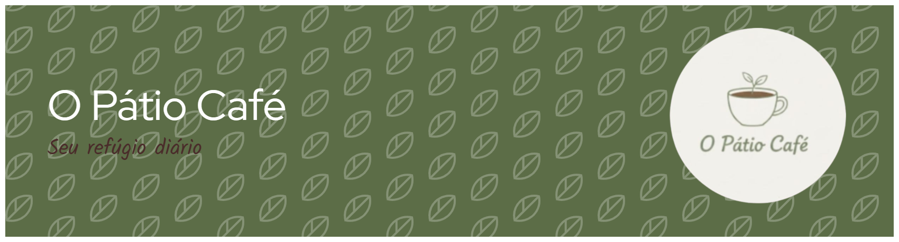

<p align="center">
  <a href="https://mackaulyn.github.io/O-Patio-Cafe/">
    
  </a>
</p>

# ☕ O Pátio Café - Seu Refúgio Diário

O **Pátio Café** é uma landing page moderna e responsiva desenvolvida para um café fictício. O foco do projeto foi criar um ambiente visual calmo e minimalista, utilizando técnicas avançadas de estruturação web.

🔗 **Acesse o projeto:** [Clique aqui para visualizar](https://mackaulyn.github.io/O-Patio-Cafe/)

---

## 🛠️ Tecnologias Utilizadas

Para a construção deste projeto, foram utilizadas as seguintes ferramentas:

| Categoria | Tecnologias |
| :--- | :--- |
| **Linguagens** |    |
| **Ferramentas** |   |

---

## 📌 Sobre o Projeto
Este site foi criado para praticar conceitos fundamentais de desenvolvimento web, como:
* Estruturação semântica com HTML5.
* Estilização avançada com CSS3 (Variáveis e Flexbox).
* Interatividade com JavaScript para menus mobile.
* Design focado na experiência do usuário (UX) em landing pages.

## ✨ Funcionalidades do Código
Com base nos arquivos desenvolvidos, o sistema possui:
* **Navegação Dinâmica:** Menu hambúrguer interativo (`script.js`) para telas menores.
* **Cardápio Visual:** Organizado em Grid (`cardapio.html`), facilitando a visualização de produtos como o *Avocado Coffee*.
* **Formulário de Reserva:** Validação de campos para agendamento de mesas (`reserva.html`).
* **Página de Sucesso:** Fluxo completo de usuário com confirmação de envio (`obrigado.html`).
* **Design Responsivo:** Adaptado para celulares e desktops através de Media Queries no `style.css`.

## 📂 Estrutura de Arquivos
* `index.html`: Página principal com destaques e depoimentos.
* `cardapio.html`: Listagem de produtos e preços.
* `reserva.html`: Formulário de agendamento.
* `sobre.html`: História e filosofia da marca.
* `style.css`: Estilização global e paleta de cores (Verde Sálvia, Café Escuro, Rosa Chá).
* `script.js`: Lógica do menu responsivo.

## 🚀 Como Executar
1. Clone este repositório:
   
   ```bash
   git clone https://github.com/seu-usuario/o-patio-cafe.git

2. Entre na pasta do projeto:
   
   ```bash
   cd o-patio-cafe

3. Abra o arquivo `index.html` no seu navegador de preferência.

---

Desenvolvido por Mackaulyn Rocha - Estudante de Informática.
